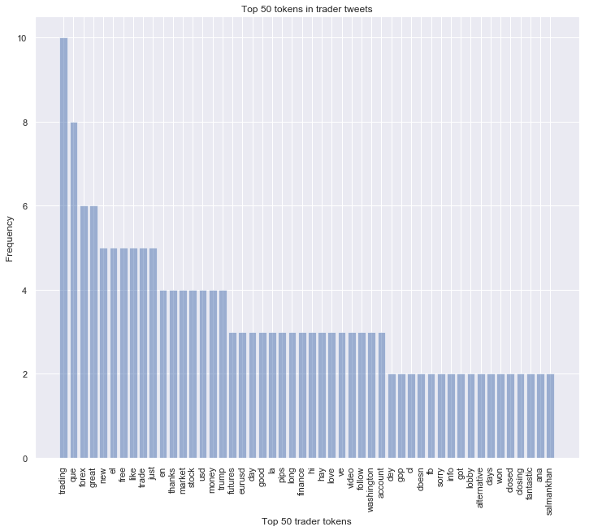
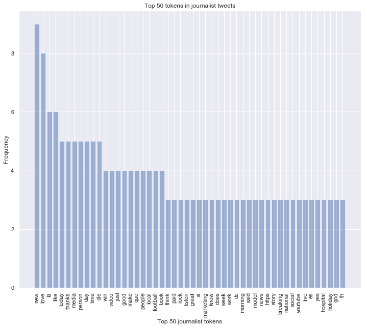
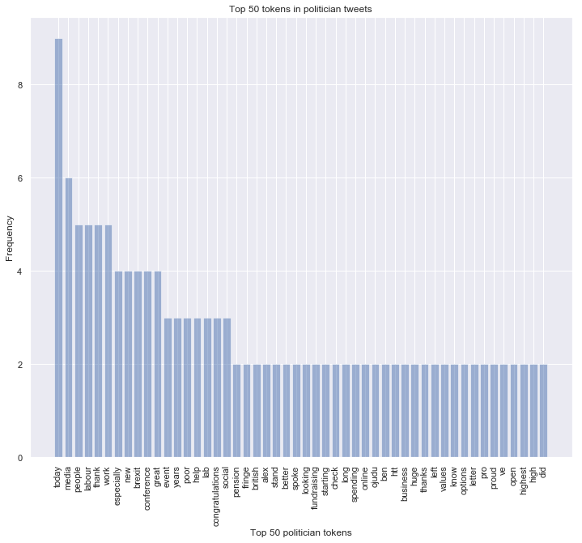
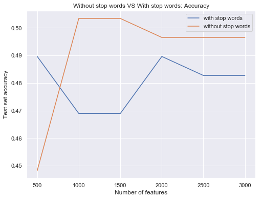

# Overview
The goal of this assignment is to predict category for the given Twitter post. The categories can be: __(A) Political (B) Finance (C) Journal__. The dataset was small (just around 500 example) and the data within it was skewed, which greatly impacted on the difficulty of building good classifier. After creating a lot of custom features, using _bag-of-words_ and applying the logistic regression, the classification accuracy at level of 51% was achieved.

# 1. Getting Data from Twitter API
I will be using a Python library call `Tweepy` to connect to Twitter API and downloading the data.


```python
import tweepy
import json
import numpy as np
import pandas as pd
from tweepy import OAuthHandler
from tweepy import API
from tweepy import Cursor
from datetime import datetime, date, time, timedelta
from collections import Counter
import sys
```


```python
consumer_key = 'ZKlfP6lgUIVSl6QAzXNvRyqfs'
consumer_secret = '7LBH2g8Hk05Sxa6rqnB27Aq2viaqEdMuf3fDLBEH4JSECbAVEy'
```


```python
# Consumer key authentication
auth = OAuthHandler(consumer_key, consumer_secret)
```


```python
access_token = '1042808210149715969-9XmzvVeFRvtkQZW8cVXbEMFsbZm3m0'
access_token_secret = 'Afkg5xl3AQa5fN0JoWFDVXtQf1GkC220Lkjt9HLOn3BR6'
```


```python
# Access key authentication
auth.set_access_token(access_token, access_token_secret)
```


```python
api = tweepy.API(auth, wait_on_rate_limit=True, wait_on_rate_limit_notify=True)
```

The `test.csv` inclued a set of 500 Twitter user IDs


```python
test = pd.read_csv('test.csv')
test.head()
```


<div>
<style scoped>
    .dataframe tbody tr th:only-of-type {
        vertical-align: middle;
    }

    .dataframe tbody tr th {
        vertical-align: top;
    }

    .dataframe thead th {
        text-align: right;
    }
</style>
<table border="1" class="dataframe">
  <thead>
    <tr style="text-align: right;">
      <th></th>
      <th>Twitter Id</th>
      <th>Category</th>
    </tr>
  </thead>
  <tbody>
    <tr>
      <th>0</th>
      <td>4912945864</td>
      <td>Politician</td>
    </tr>
    <tr>
      <th>1</th>
      <td>1900694785</td>
      <td>Politician</td>
    </tr>
    <tr>
      <th>2</th>
      <td>1887255132</td>
      <td>Politician</td>
    </tr>
    <tr>
      <th>3</th>
      <td>1873380343</td>
      <td>Politician</td>
    </tr>
    <tr>
      <th>4</th>
      <td>1872999342</td>
      <td>Politician</td>
    </tr>
  </tbody>
</table>
</div>


```python
id_list = test['Twitter Id'].tolist() # Convert to list
```

Because `tweepy` does not support to get more than 100 users at time. Therefore, I will write the function that can get the tweets of more than 100 users


```python
def lookup_user_list(followers_id, api):
    full_users = []
    users_count = len(followers_id)
    while True:
        try:
            for i in range(int(users_count / 100) + 1):
                full_users.extend(api.lookup_users(user_ids=followers_id[i*100:min((i+1)*100, users_count)]))
                print('getting users batch:', i)
        except tweepy.TweepError as e:
            print('Something went wrong, quitting...', e)
            time.sleep(15 * 60)
        return full_users
```

Apply function


```python
results = lookup_user_list(id_list, api) 
```

    getting users batch: 0
    getting users batch: 1
    getting users batch: 2
    getting users batch: 3
    getting users batch: 4
    getting users batch: 5
    

Wrangle the data into one dataframe


```python
# Create JSON
js = json.dumps([status._json for status in results]) 

users = pd.read_json(js, orient='records')
```


```python
users_full = pd.merge(test, users, left_on='Twitter Id', right_on='id', how='left').drop('id', axis=1)
```

Let's look at our new dataframe `users_full`


```python
users_full.head()
```


<div>
<style scoped>
    .dataframe tbody tr th:only-of-type {
        vertical-align: middle;
    }

    .dataframe tbody tr th {
        vertical-align: top;
    }

    .dataframe thead th {
        text-align: right;
    }
</style>
<table border="1" class="dataframe">
  <thead>
    <tr style="text-align: right;">
      <th></th>
      <th>Twitter Id</th>
      <th>Category</th>
      <th>contributors_enabled</th>
      <th>created_at</th>
      <th>default_profile</th>
      <th>default_profile_image</th>
      <th>description</th>
      <th>entities</th>
      <th>favourites_count</th>
      <th>follow_request_sent</th>
      <th>...</th>
      <th>profile_use_background_image</th>
      <th>protected</th>
      <th>screen_name</th>
      <th>status</th>
      <th>statuses_count</th>
      <th>time_zone</th>
      <th>translator_type</th>
      <th>url</th>
      <th>utc_offset</th>
      <th>verified</th>
    </tr>
  </thead>
  <tbody>
    <tr>
      <th>0</th>
      <td>4912945864</td>
      <td>Politician</td>
      <td>False</td>
      <td>2016-02-15 10:23:32</td>
      <td>False</td>
      <td>False</td>
      <td>District Councillor for SODC Chinnor Ward with...</td>
      <td>{'description': {'urls': []}}</td>
      <td>18643.0</td>
      <td>False</td>
      <td>...</td>
      <td>True</td>
      <td>False</td>
      <td>IanWhite_DC</td>
      <td>{'created_at': 'Wed Sep 26 17:41:00 +0000 2018...</td>
      <td>12991.0</td>
      <td>NaN</td>
      <td>none</td>
      <td>None</td>
      <td>NaN</td>
      <td>False</td>
    </tr>
    <tr>
      <th>1</th>
      <td>1900694785</td>
      <td>Politician</td>
      <td>False</td>
      <td>2013-09-24 14:29:28</td>
      <td>False</td>
      <td>False</td>
      <td>ケネディ前大使のアーカイブアカウント。アメリカ大使館のニュースは@USEmbassyToky...</td>
      <td>{'url': {'urls': [{'url': 'https://t.co/hED6j9...</td>
      <td>344.0</td>
      <td>False</td>
      <td>...</td>
      <td>False</td>
      <td>False</td>
      <td>AmbCKennedy</td>
      <td>{'created_at': 'Wed Jan 18 12:02:53 +0000 2017...</td>
      <td>979.0</td>
      <td>NaN</td>
      <td>none</td>
      <td>https://t.co/hED6j945kN</td>
      <td>NaN</td>
      <td>True</td>
    </tr>
    <tr>
      <th>2</th>
      <td>1887255132</td>
      <td>Politician</td>
      <td>False</td>
      <td>2013-09-20 17:48:12</td>
      <td>True</td>
      <td>False</td>
      <td>My tweets and views are my own. Philadelphia, PA.</td>
      <td>{'url': {'urls': [{'url': 'https://t.co/FudBly...</td>
      <td>125.0</td>
      <td>False</td>
      <td>...</td>
      <td>True</td>
      <td>False</td>
      <td>grustia_aarp</td>
      <td>{'created_at': 'Sun Sep 16 12:08:47 +0000 2018...</td>
      <td>251.0</td>
      <td>NaN</td>
      <td>none</td>
      <td>https://t.co/FudBly9U3r</td>
      <td>NaN</td>
      <td>False</td>
    </tr>
    <tr>
      <th>3</th>
      <td>1873380343</td>
      <td>Politician</td>
      <td>False</td>
      <td>2013-09-16 23:20:09</td>
      <td>False</td>
      <td>False</td>
      <td>Owner, Faye's Fabulous Flowers</td>
      <td>{'url': {'urls': [{'url': 'https://t.co/I3gYTJ...</td>
      <td>165.0</td>
      <td>False</td>
      <td>...</td>
      <td>True</td>
      <td>False</td>
      <td>drfayenaples</td>
      <td>{'created_at': 'Fri Jul 27 00:45:10 +0000 2018...</td>
      <td>199.0</td>
      <td>NaN</td>
      <td>none</td>
      <td>https://t.co/I3gYTJmraD</td>
      <td>NaN</td>
      <td>False</td>
    </tr>
    <tr>
      <th>4</th>
      <td>1872999342</td>
      <td>Politician</td>
      <td>False</td>
      <td>2013-09-16 21:08:18</td>
      <td>False</td>
      <td>False</td>
      <td>Campaign account for Senator Chuck Schumer, D-...</td>
      <td>{'url': {'urls': [{'url': 'http://t.co/BooKG20...</td>
      <td>7.0</td>
      <td>False</td>
      <td>...</td>
      <td>True</td>
      <td>False</td>
      <td>chuckschumer</td>
      <td>{'created_at': 'Tue Dec 19 22:17:23 +0000 2017...</td>
      <td>378.0</td>
      <td>NaN</td>
      <td>none</td>
      <td>http://t.co/BooKG20lX6</td>
      <td>NaN</td>
      <td>True</td>
    </tr>
  </tbody>
</table>
<p>5 rows × 44 columns</p>
</div>


```python
users_full.info()
```

    <class 'pandas.core.frame.DataFrame'>
    Int64Index: 556 entries, 0 to 555
    Data columns (total 44 columns):
    Twitter Id                            556 non-null int64
    Category                              556 non-null object
    contributors_enabled                  515 non-null object
    created_at                            515 non-null datetime64[ns]
    default_profile                       515 non-null object
    default_profile_image                 515 non-null object
    description                           515 non-null object
    entities                              515 non-null object
    favourites_count                      515 non-null float64
    follow_request_sent                   515 non-null object
    followers_count                       515 non-null float64
    following                             515 non-null object
    friends_count                         515 non-null float64
    geo_enabled                           515 non-null object
    has_extended_profile                  515 non-null object
    id_str                                515 non-null float64
    is_translation_enabled                515 non-null object
    is_translator                         515 non-null object
    lang                                  515 non-null object
    listed_count                          515 non-null float64
    location                              515 non-null object
    name                                  515 non-null object
    notifications                         515 non-null object
    profile_background_color              515 non-null object
    profile_background_image_url          370 non-null object
    profile_background_image_url_https    370 non-null object
    profile_background_tile               515 non-null object
    profile_banner_url                    353 non-null object
    profile_image_url                     515 non-null object
    profile_image_url_https               515 non-null object
    profile_link_color                    515 non-null object
    profile_sidebar_border_color          515 non-null object
    profile_sidebar_fill_color            515 non-null object
    profile_text_color                    515 non-null object
    profile_use_background_image          515 non-null object
    protected                             515 non-null object
    screen_name                           515 non-null object
    status                                481 non-null object
    statuses_count                        515 non-null float64
    time_zone                             0 non-null float64
    translator_type                       515 non-null object
    url                                   233 non-null object
    utc_offset                            0 non-null float64
    verified                              515 non-null object
    dtypes: datetime64[ns](1), float64(8), int64(1), object(34)
    memory usage: 195.5+ KB
    


```python
users_full['status'][0]
```


    {'created_at': 'Wed Sep 26 17:41:00 +0000 2018',
     'id': 1045005329950543873,
     'id_str': '1045005329950543873',
     'text': 'SODC Planning Committee tonight at Didcot Civic Hall. Some interesting cases on the agenda including Wyevale at Hen… https://t.co/orVajyM0Jx',
     'truncated': True,
     'entities': {'hashtags': [],
      'symbols': [],
      'user_mentions': [],
      'urls': [{'url': 'https://t.co/orVajyM0Jx',
        'expanded_url': 'https://twitter.com/i/web/status/1045005329950543873',
        'display_url': 'twitter.com/i/web/status/1…',
        'indices': [117, 140]}]},
     'source': '<a href="https://buffer.com" rel="nofollow">Buffer</a>',
     'in_reply_to_status_id': None,
     'in_reply_to_status_id_str': None,
     'in_reply_to_user_id': None,
     'in_reply_to_user_id_str': None,
     'in_reply_to_screen_name': None,
     'geo': None,
     'coordinates': None,
     'place': None,
     'contributors': None,
     'is_quote_status': False,
     'retweet_count': 1,
     'favorite_count': 1,
     'favorited': False,
     'retweeted': False,
     'lang': 'en'}


There are lots of information we can get but for purpose of this assignment, I just want to collect the recent tweet from each of users.


```python
data = users_full[['Twitter Id','Category','status']]
```


```python
data.head()
```


<div>
<style scoped>
    .dataframe tbody tr th:only-of-type {
        vertical-align: middle;
    }

    .dataframe tbody tr th {
        vertical-align: top;
    }

    .dataframe thead th {
        text-align: right;
    }
</style>
<table border="1" class="dataframe">
  <thead>
    <tr style="text-align: right;">
      <th></th>
      <th>Twitter Id</th>
      <th>Category</th>
      <th>status</th>
    </tr>
  </thead>
  <tbody>
    <tr>
      <th>0</th>
      <td>4912945864</td>
      <td>Politician</td>
      <td>{'created_at': 'Wed Sep 26 17:41:00 +0000 2018...</td>
    </tr>
    <tr>
      <th>1</th>
      <td>1900694785</td>
      <td>Politician</td>
      <td>{'created_at': 'Wed Jan 18 12:02:53 +0000 2017...</td>
    </tr>
    <tr>
      <th>2</th>
      <td>1887255132</td>
      <td>Politician</td>
      <td>{'created_at': 'Sun Sep 16 12:08:47 +0000 2018...</td>
    </tr>
    <tr>
      <th>3</th>
      <td>1873380343</td>
      <td>Politician</td>
      <td>{'created_at': 'Fri Jul 27 00:45:10 +0000 2018...</td>
    </tr>
    <tr>
      <th>4</th>
      <td>1872999342</td>
      <td>Politician</td>
      <td>{'created_at': 'Tue Dec 19 22:17:23 +0000 2017...</td>
    </tr>
  </tbody>
</table>
</div>


```python
data.info()
```

    <class 'pandas.core.frame.DataFrame'>
    Int64Index: 556 entries, 0 to 555
    Data columns (total 3 columns):
    Twitter Id    556 non-null int64
    Category      556 non-null object
    status        481 non-null object
    dtypes: int64(1), object(2)
    memory usage: 37.4+ KB
    

Remove some missing values in the `status` column.


```python
data = data[pd.notnull(data['status'])]
data = data.reset_index(drop=True)
data.info()
```

    <class 'pandas.core.frame.DataFrame'>
    RangeIndex: 481 entries, 0 to 480
    Data columns (total 3 columns):
    Twitter Id    481 non-null int64
    Category      481 non-null object
    status        481 non-null object
    dtypes: int64(1), object(2)
    memory usage: 11.4+ KB
    


```python
data['tweets'] = [data['status'][i].get('text') for i in range(0,len(data))]
data = data.drop('status', axis=1)
data.head()
```


<div>
<style scoped>
    .dataframe tbody tr th:only-of-type {
        vertical-align: middle;
    }

    .dataframe tbody tr th {
        vertical-align: top;
    }

    .dataframe thead th {
        text-align: right;
    }
</style>
<table border="1" class="dataframe">
  <thead>
    <tr style="text-align: right;">
      <th></th>
      <th>Twitter Id</th>
      <th>Category</th>
      <th>tweets</th>
    </tr>
  </thead>
  <tbody>
    <tr>
      <th>0</th>
      <td>4912945864</td>
      <td>Politician</td>
      <td>SODC Planning Committee tonight at Didcot Civi...</td>
    </tr>
    <tr>
      <th>1</th>
      <td>1900694785</td>
      <td>Politician</td>
      <td>今まで本当にありがとうございました。今後は@USEmbassyTokyoをフォローしてくださ...</td>
    </tr>
    <tr>
      <th>2</th>
      <td>1887255132</td>
      <td>Politician</td>
      <td>@MrRawle Well deserved. Congratulations!!!</td>
    </tr>
    <tr>
      <th>3</th>
      <td>1873380343</td>
      <td>Politician</td>
      <td>2 people unfollowed me // automatically checke...</td>
    </tr>
    <tr>
      <th>4</th>
      <td>1872999342</td>
      <td>Politician</td>
      <td>RT @lilybatch: New estimates: Final tax plan w...</td>
    </tr>
  </tbody>
</table>
</div>


Save the `data` to the `data.csv` file.


```python
data.to_csv('data.csv', index=False)
```

# 2. Data preprocessing
In this step I will do cleansing: remove URLs, usernames(mentions), tweets not available text, hashtag, numbers, special characters; text processing: tokenize, transform to lowercase.


```python
import matplotlib.pyplot as plt
import seaborn as sns
from bs4 import BeautifulSoup
from collections import Counter
from nltk.tokenize import WordPunctTokenizer
from nltk.corpus import stopwords
import string
import re 
import gensim
import warnings
warnings.filterwarnings('ignore')
sns.set()
```

    C:\Users\Augustine\Anaconda3\lib\site-packages\gensim\utils.py:1209: UserWarning: detected Windows; aliasing chunkize to chunkize_serial
      warnings.warn("detected Windows; aliasing chunkize to chunkize_serial")
    

Defining data cleaning function


```python
tok = WordPunctTokenizer()

pat1 = r'RT @[A-Za-z0-9_]+'
pat2 = r'https?://[^ ]+'
combined_pat = r'|'.join((pat1, pat2))
www_pat = r'www.[^ ]+'
negations_dic = {"isn't":"is not", "aren't":"are not", "wasn't":"was not", "weren't":"were not",
                "haven't":"have not","hasn't":"has not","hadn't":"had not","won't":"will not",
                "wouldn't":"would not", "don't":"do not", "doesn't":"does not","didn't":"did not",
                "can't":"can not","couldn't":"could not","shouldn't":"should not","mightn't":"might not",
                "mustn't":"must not"}
neg_pattern = re.compile(r'\b(' + '|'.join(negations_dic.keys()) + r')\b')

def tweet_cleaner(text):
    soup = BeautifulSoup(text, 'lxml')
    souped = soup.get_text()
    try:
        bom_removed = souped.decode("utf-8-sig").replace(u"\ufffd", "?")
    except:
        bom_removed = souped
    stripped = re.sub(combined_pat, '', bom_removed)
    stripped = re.sub(www_pat, '', stripped)
    lower_case = stripped.lower()
    neg_handled = neg_pattern.sub(lambda x: negations_dic[x.group()], lower_case)
    letters_only = re.sub("[^a-zA-Z]", " ", neg_handled)
    # During the letters_only process two lines above, it has created unnecessay white spaces,
    # I will tokenize and join together to remove unneccessary white spaces
    words = [x for x  in tok.tokenize(letters_only) if len(x) > 1]
    return (" ".join(words)).strip()
```

Apply `tweet_cleaner` function


```python
tweets_list = data.tweets.tolist()
results = []
for t in tweets_list:
    results.append(tweet_cleaner(t))
```


```python
clean_data = pd.DataFrame(results,columns=['tweet'])
clean_data['category'] = data['Category']
clean_data['id'] = data['Twitter Id']
clean_data.head()
```


<div>
<style scoped>
    .dataframe tbody tr th:only-of-type {
        vertical-align: middle;
    }

    .dataframe tbody tr th {
        vertical-align: top;
    }

    .dataframe thead th {
        text-align: right;
    }
</style>
<table border="1" class="dataframe">
  <thead>
    <tr style="text-align: right;">
      <th></th>
      <th>tweet</th>
      <th>category</th>
      <th>id</th>
    </tr>
  </thead>
  <tbody>
    <tr>
      <th>0</th>
      <td>sodc planning committee tonight at didcot civi...</td>
      <td>Politician</td>
      <td>4912945864</td>
    </tr>
    <tr>
      <th>1</th>
      <td>usembassytokyo imamade hontoni arigato gozaima...</td>
      <td>Politician</td>
      <td>1900694785</td>
    </tr>
    <tr>
      <th>2</th>
      <td>mrrawle well deserved congratulations</td>
      <td>Politician</td>
      <td>1887255132</td>
    </tr>
    <tr>
      <th>3</th>
      <td>people unfollowed me automatically checked by</td>
      <td>Politician</td>
      <td>1873380343</td>
    </tr>
    <tr>
      <th>4</th>
      <td>new estimates final tax plan would raise taxes...</td>
      <td>Politician</td>
      <td>1872999342</td>
    </tr>
  </tbody>
</table>
</div>


```python
clean_data.info()
```

    <class 'pandas.core.frame.DataFrame'>
    RangeIndex: 481 entries, 0 to 480
    Data columns (total 3 columns):
    tweet       481 non-null object
    category    481 non-null object
    id          481 non-null int64
    dtypes: int64(1), object(2)
    memory usage: 11.4+ KB
    


```python
clean_data.to_csv('clean_data.csv', index=False, encoding='utf-8')
```

# 3. Exploratory data analysis (EDA)
Before do data visualization, I want to known that what kind of words are used in the tweets, and how many times it is used in entire corpus. I used count vectorizer to calculate the term frequencies.
There are parameter options available for count vectorizer, such as removing stop words, limiting the maximum number of terms. However, I just implemented with stop words included, and not limiting the maximum number of terms.


```python
from sklearn.feature_extraction.text import CountVectorizer
```


```python
data = clean_data.copy()
data.dropna(inplace=True)
data.reset_index(drop=True,inplace=True)
```


```python
data.info()
```

    <class 'pandas.core.frame.DataFrame'>
    RangeIndex: 481 entries, 0 to 480
    Data columns (total 3 columns):
    tweet       481 non-null object
    category    481 non-null object
    id          481 non-null int64
    dtypes: int64(1), object(2)
    memory usage: 11.4+ KB
    


```python
cvec = CountVectorizer()
cvec.fit(data.tweet)
```


    CountVectorizer(analyzer='word', binary=False, decode_error='strict',
            dtype=<class 'numpy.int64'>, encoding='utf-8', input='content',
            lowercase=True, max_df=1.0, max_features=None, min_df=1,
            ngram_range=(1, 1), preprocessor=None, stop_words=None,
            strip_accents=None, token_pattern='(?u)\\b\\w\\w+\\b',
            tokenizer=None, vocabulary=None)


```python
len(cvec.get_feature_names()) # 2931 words out of the corpus
```


    2907


```python
data.category.value_counts()
```


    Journalist    224
    Trader        144
    Politician    113
    Name: category, dtype: int64


Getting term frequency for each class can be obtained with the below code block.


```python
journalist_doc_matrix = cvec.transform(data[data.category == 'Journalist'].tweet)
trader_doc_matrix = cvec.transform(data[data.category == 'Trader'].tweet)
politician_doc_matrix = cvec.transform(data[data.category == 'Politician'].tweet)

journalist_tf = np.sum(journalist_doc_matrix,axis=0)
trader_tf = np.sum(trader_doc_matrix,axis=0)
politician_tf = np.sum(politician_doc_matrix,axis=0)

journalist = np.squeeze(np.asarray(journalist_tf))
trader = np.squeeze(np.asarray(trader_tf))
politician =  np.squeeze(np.asarray(politician_tf))

term_freq_df = pd.DataFrame([journalist,trader,politician],columns=cvec.get_feature_names()).transpose()
```


```python
document_matrix = cvec.transform(data.tweet)
```


```python
data[data.category == 'Politician'].tail()
```


<div>
<style scoped>
    .dataframe tbody tr th:only-of-type {
        vertical-align: middle;
    }

    .dataframe tbody tr th {
        vertical-align: top;
    }

    .dataframe thead th {
        text-align: right;
    }
</style>
<table border="1" class="dataframe">
  <thead>
    <tr style="text-align: right;">
      <th></th>
      <th>tweet</th>
      <th>category</th>
      <th>id</th>
    </tr>
  </thead>
  <tbody>
    <tr>
      <th>108</th>
      <td>should charges have been laid</td>
      <td>Politician</td>
      <td>122487895</td>
    </tr>
    <tr>
      <th>109</th>
      <td>social media can be useful tool for communicat...</td>
      <td>Politician</td>
      <td>121484113</td>
    </tr>
    <tr>
      <th>110</th>
      <td>reverse conference bounce for lab in any case ...</td>
      <td>Politician</td>
      <td>121127090</td>
    </tr>
    <tr>
      <th>111</th>
      <td>trump signs billion bill to give vets more hea...</td>
      <td>Politician</td>
      <td>120334688</td>
    </tr>
    <tr>
      <th>112</th>
      <td>this this is all you need to know after years ...</td>
      <td>Politician</td>
      <td>118429508</td>
    </tr>
  </tbody>
</table>
</div>


```python
%%time
politician_batches = np.linspace(0,113,100).astype(int)
i=0
politician_tf = []
while i < len(politician_batches)-1:
    batch_result = np.sum(document_matrix[politician_batches[i]:politician_batches[i+1]].toarray(),axis=0)
    politician_tf.append(batch_result)
    if (i % 10 == 0) | (i == len(politician_batches)-2):
        print(politician_batches[i+1],"entries' term freuquency calculated")
    i += 1
```

    1 entries' term freuquency calculated
    12 entries' term freuquency calculated
    23 entries' term freuquency calculated
    35 entries' term freuquency calculated
    46 entries' term freuquency calculated
    58 entries' term freuquency calculated
    69 entries' term freuquency calculated
    81 entries' term freuquency calculated
    92 entries' term freuquency calculated
    103 entries' term freuquency calculated
    113 entries' term freuquency calculated
    Wall time: 31.2 ms
    


```python
data[data.category == 'Trader'].head()
```


<div>
<style scoped>
    .dataframe tbody tr th:only-of-type {
        vertical-align: middle;
    }

    .dataframe tbody tr th {
        vertical-align: top;
    }

    .dataframe thead th {
        text-align: right;
    }
</style>
<table border="1" class="dataframe">
  <thead>
    <tr style="text-align: right;">
      <th></th>
      <th>tweet</th>
      <th>category</th>
      <th>id</th>
    </tr>
  </thead>
  <tbody>
    <tr>
      <th>113</th>
      <td>laminine stardnienie rozsiane sm</td>
      <td>Trader</td>
      <td>1898394962</td>
    </tr>
    <tr>
      <th>114</th>
      <td>sorry for not being online guys ll be back in ...</td>
      <td>Trader</td>
      <td>1895120856</td>
    </tr>
    <tr>
      <th>115</th>
      <td>eminiplayer mac book air</td>
      <td>Trader</td>
      <td>1893573728</td>
    </tr>
    <tr>
      <th>116</th>
      <td>get free demo account when you register with g...</td>
      <td>Trader</td>
      <td>1885693524</td>
    </tr>
    <tr>
      <th>117</th>
      <td>ahahha this sounds optimistic meanwhile the ja...</td>
      <td>Trader</td>
      <td>1885361696</td>
    </tr>
  </tbody>
</table>
</div>


```python
data[data.category == 'Trader'].tail()
```


<div>
<style scoped>
    .dataframe tbody tr th:only-of-type {
        vertical-align: middle;
    }

    .dataframe tbody tr th {
        vertical-align: top;
    }

    .dataframe thead th {
        text-align: right;
    }
</style>
<table border="1" class="dataframe">
  <thead>
    <tr style="text-align: right;">
      <th></th>
      <th>tweet</th>
      <th>category</th>
      <th>id</th>
    </tr>
  </thead>
  <tbody>
    <tr>
      <th>252</th>
      <td>mini futures trading community at over new use...</td>
      <td>Trader</td>
      <td>120317534</td>
    </tr>
    <tr>
      <th>253</th>
      <td>my lovely girl is doing moonwalk this weekend ...</td>
      <td>Trader</td>
      <td>119391979</td>
    </tr>
    <tr>
      <th>254</th>
      <td>dec contract</td>
      <td>Trader</td>
      <td>118133820</td>
    </tr>
    <tr>
      <th>255</th>
      <td>bearish picks for axp fslr gas gild lltc nsm p...</td>
      <td>Trader</td>
      <td>118042818</td>
    </tr>
    <tr>
      <th>256</th>
      <td></td>
      <td>Trader</td>
      <td>117657763</td>
    </tr>
  </tbody>
</table>
</div>


```python
%%time
trader_batches = np.linspace(113,257,100).astype(int)
i=0
trader_tf = []
while i < len(trader_batches)-1:
    batch_result = np.sum(document_matrix[trader_batches[i]:trader_batches[i+1]].toarray(),axis=0)
    trader_tf.append(batch_result)
    if (i % 10 == 0) | (i == len(trader_batches)-2):
        print(trader_batches[i+1],"entries' term freuquency calculated")
    i += 1
```

    114 entries' term freuquency calculated
    129 entries' term freuquency calculated
    143 entries' term freuquency calculated
    158 entries' term freuquency calculated
    172 entries' term freuquency calculated
    187 entries' term freuquency calculated
    201 entries' term freuquency calculated
    216 entries' term freuquency calculated
    230 entries' term freuquency calculated
    245 entries' term freuquency calculated
    257 entries' term freuquency calculated
    Wall time: 19.4 ms
    


```python
data[data.category == 'Journalist'].tail()
```


<div>
<style scoped>
    .dataframe tbody tr th:only-of-type {
        vertical-align: middle;
    }

    .dataframe tbody tr th {
        vertical-align: top;
    }

    .dataframe thead th {
        text-align: right;
    }
</style>
<table border="1" class="dataframe">
  <thead>
    <tr style="text-align: right;">
      <th></th>
      <th>tweet</th>
      <th>category</th>
      <th>id</th>
    </tr>
  </thead>
  <tbody>
    <tr>
      <th>476</th>
      <td>colleen ham thank you so much</td>
      <td>Journalist</td>
      <td>4872732821</td>
    </tr>
    <tr>
      <th>477</th>
      <td>judge dismissed the murder charge against keit...</td>
      <td>Journalist</td>
      <td>4872357934</td>
    </tr>
    <tr>
      <th>478</th>
      <td>thanks to davenewbart for indulging me today a...</td>
      <td>Journalist</td>
      <td>4872354465</td>
    </tr>
    <tr>
      <th>479</th>
      <td>virgin media outage or service down current pr...</td>
      <td>Journalist</td>
      <td>4872197440</td>
    </tr>
    <tr>
      <th>480</th>
      <td>la fiestaca</td>
      <td>Journalist</td>
      <td>4872173549</td>
    </tr>
  </tbody>
</table>
</div>


```python
%%time
journalist_batches = np.linspace(256,481,100).astype(int)
i=0
journalist_tf = []
while i < len(journalist_batches)-1:
    batch_result = np.sum(document_matrix[journalist_batches[i]:journalist_batches[i+1]].toarray(),axis=0)
    journalist_tf.append(batch_result)
    if (i % 10 == 0) | (i == len(journalist_batches)-2):
        print(journalist_batches[i+1],"entries' term freuquency calculated")
    i += 1
```

    258 entries' term freuquency calculated
    281 entries' term freuquency calculated
    303 entries' term freuquency calculated
    326 entries' term freuquency calculated
    349 entries' term freuquency calculated
    371 entries' term freuquency calculated
    394 entries' term freuquency calculated
    417 entries' term freuquency calculated
    440 entries' term freuquency calculated
    462 entries' term freuquency calculated
    481 entries' term freuquency calculated
    Wall time: 24 ms
    


```python
journalist = np.sum(journalist_tf,axis=0)
trader = np.sum(trader_tf,axis=0)
politician = np.sum(politician_tf,axis=0)
term_freq_df = pd.DataFrame([journalist,trader,politician],columns=cvec.get_feature_names()).transpose()
term_freq_df.head()
```


<div>
<style scoped>
    .dataframe tbody tr th:only-of-type {
        vertical-align: middle;
    }

    .dataframe tbody tr th {
        vertical-align: top;
    }

    .dataframe thead th {
        text-align: right;
    }
</style>
<table border="1" class="dataframe">
  <thead>
    <tr style="text-align: right;">
      <th></th>
      <th>0</th>
      <th>1</th>
      <th>2</th>
    </tr>
  </thead>
  <tbody>
    <tr>
      <th>aaa</th>
      <td>0</td>
      <td>0</td>
      <td>1</td>
    </tr>
    <tr>
      <th>aapl</th>
      <td>0</td>
      <td>1</td>
      <td>0</td>
    </tr>
    <tr>
      <th>aaronw</th>
      <td>0</td>
      <td>1</td>
      <td>0</td>
    </tr>
    <tr>
      <th>abarth</th>
      <td>1</td>
      <td>0</td>
      <td>0</td>
    </tr>
    <tr>
      <th>abc</th>
      <td>1</td>
      <td>0</td>
      <td>0</td>
    </tr>
  </tbody>
</table>
</div>


```python
term_freq_df.columns = ['journalist', 'trader', 'politician']
term_freq_df['total'] = term_freq_df['journalist'] + term_freq_df['trader'] + term_freq_df['politician']
term_freq_df.sort_values(by='total', ascending=False).iloc[:10] # Top frequent words by total
```


<div>
<style scoped>
    .dataframe tbody tr th:only-of-type {
        vertical-align: middle;
    }

    .dataframe tbody tr th {
        vertical-align: top;
    }

    .dataframe thead th {
        text-align: right;
    }
</style>
<table border="1" class="dataframe">
  <thead>
    <tr style="text-align: right;">
      <th></th>
      <th>journalist</th>
      <th>trader</th>
      <th>politician</th>
      <th>total</th>
    </tr>
  </thead>
  <tbody>
    <tr>
      <th>the</th>
      <td>89</td>
      <td>43</td>
      <td>62</td>
      <td>194</td>
    </tr>
    <tr>
      <th>to</th>
      <td>60</td>
      <td>30</td>
      <td>49</td>
      <td>139</td>
    </tr>
    <tr>
      <th>and</th>
      <td>38</td>
      <td>26</td>
      <td>36</td>
      <td>100</td>
    </tr>
    <tr>
      <th>of</th>
      <td>45</td>
      <td>14</td>
      <td>33</td>
      <td>92</td>
    </tr>
    <tr>
      <th>in</th>
      <td>38</td>
      <td>23</td>
      <td>20</td>
      <td>81</td>
    </tr>
    <tr>
      <th>you</th>
      <td>30</td>
      <td>18</td>
      <td>20</td>
      <td>68</td>
    </tr>
    <tr>
      <th>for</th>
      <td>26</td>
      <td>19</td>
      <td>19</td>
      <td>64</td>
    </tr>
    <tr>
      <th>on</th>
      <td>22</td>
      <td>13</td>
      <td>18</td>
      <td>53</td>
    </tr>
    <tr>
      <th>is</th>
      <td>23</td>
      <td>10</td>
      <td>8</td>
      <td>41</td>
    </tr>
    <tr>
      <th>this</th>
      <td>18</td>
      <td>9</td>
      <td>12</td>
      <td>39</td>
    </tr>
  </tbody>
</table>
</div>


You can see that the most frequent words are all stop words like `the`,`to`,`and`,`of`, ect. If these stop words dominate both of the classes, I won't be able to have a meaningful result. So, I decided to remove stop words.


```python
cvec = CountVectorizer(stop_words='english',max_features=10000)
cvec.fit(data.tweet)
```


    CountVectorizer(analyzer='word', binary=False, decode_error='strict',
            dtype=<class 'numpy.int64'>, encoding='utf-8', input='content',
            lowercase=True, max_df=1.0, max_features=10000, min_df=1,
            ngram_range=(1, 1), preprocessor=None, stop_words='english',
            strip_accents=None, token_pattern='(?u)\\b\\w\\w+\\b',
            tokenizer=None, vocabulary=None)


```python
document_matrix = cvec.transform(data.tweet)
```


```python
%%time
politician_batches = np.linspace(0,113,100).astype(int)
i=0
politician_tf = []
while i < len(politician_batches)-1:
    batch_result = np.sum(document_matrix[politician_batches[i]:politician_batches[i+1]].toarray(),axis=0)
    politician_tf.append(batch_result)
    if (i % 10 == 0) | (i == len(politician_batches)-2):
        print(politician_batches[i+1],"entries' term freuquency calculated")
    i += 1
```

    1 entries' term freuquency calculated
    12 entries' term freuquency calculated
    23 entries' term freuquency calculated
    35 entries' term freuquency calculated
    46 entries' term freuquency calculated
    58 entries' term freuquency calculated
    69 entries' term freuquency calculated
    81 entries' term freuquency calculated
    92 entries' term freuquency calculated
    103 entries' term freuquency calculated
    113 entries' term freuquency calculated
    Wall time: 40.6 ms
    


```python
%%time
trader_batches = np.linspace(113,257,100).astype(int)
i=0
trader_tf = []
while i < len(trader_batches)-1:
    batch_result = np.sum(document_matrix[trader_batches[i]:trader_batches[i+1]].toarray(),axis=0)
    trader_tf.append(batch_result)
    if (i % 10 == 0) | (i == len(trader_batches)-2):
        print(trader_batches[i+1],"entries' term freuquency calculated")
    i += 1
```

    114 entries' term freuquency calculated
    129 entries' term freuquency calculated
    143 entries' term freuquency calculated
    158 entries' term freuquency calculated
    172 entries' term freuquency calculated
    187 entries' term freuquency calculated
    201 entries' term freuquency calculated
    216 entries' term freuquency calculated
    230 entries' term freuquency calculated
    245 entries' term freuquency calculated
    257 entries' term freuquency calculated
    Wall time: 15.6 ms
    


```python
%%time
journalist_batches = np.linspace(256,481,100).astype(int)
i=0
journalist_tf = []
while i < len(journalist_batches)-1:
    batch_result = np.sum(document_matrix[journalist_batches[i]:journalist_batches[i+1]].toarray(),axis=0)
    journalist_tf.append(batch_result)
    if (i % 10 == 0) | (i == len(journalist_batches)-2):
        print(journalist_batches[i+1],"entries' term freuquency calculated")
    i += 1
```

    258 entries' term freuquency calculated
    281 entries' term freuquency calculated
    303 entries' term freuquency calculated
    326 entries' term freuquency calculated
    349 entries' term freuquency calculated
    371 entries' term freuquency calculated
    394 entries' term freuquency calculated
    417 entries' term freuquency calculated
    440 entries' term freuquency calculated
    462 entries' term freuquency calculated
    481 entries' term freuquency calculated
    Wall time: 15.6 ms
    


```python
journalist = np.sum(journalist_tf,axis=0)
trader = np.sum(trader_tf,axis=0)
politician = np.sum(politician_tf,axis=0)
term_freq_df2 = pd.DataFrame([journalist,trader,politician],columns=cvec.get_feature_names()).transpose()

term_freq_df2.columns = ['journalist', 'trader', 'politician']
term_freq_df2['total'] = term_freq_df2['journalist'] + term_freq_df2['trader'] + term_freq_df2['politician']
term_freq_df2.sort_values(by='total', ascending=False).iloc[:10]
```


<div>
<style scoped>
    .dataframe tbody tr th:only-of-type {
        vertical-align: middle;
    }

    .dataframe tbody tr th {
        vertical-align: top;
    }

    .dataframe thead th {
        text-align: right;
    }
</style>
<table border="1" class="dataframe">
  <thead>
    <tr style="text-align: right;">
      <th></th>
      <th>journalist</th>
      <th>trader</th>
      <th>politician</th>
      <th>total</th>
    </tr>
  </thead>
  <tbody>
    <tr>
      <th>new</th>
      <td>9</td>
      <td>5</td>
      <td>4</td>
      <td>18</td>
    </tr>
    <tr>
      <th>today</th>
      <td>5</td>
      <td>2</td>
      <td>9</td>
      <td>16</td>
    </tr>
    <tr>
      <th>great</th>
      <td>3</td>
      <td>6</td>
      <td>4</td>
      <td>13</td>
    </tr>
    <tr>
      <th>que</th>
      <td>4</td>
      <td>8</td>
      <td>0</td>
      <td>12</td>
    </tr>
    <tr>
      <th>like</th>
      <td>6</td>
      <td>5</td>
      <td>1</td>
      <td>12</td>
    </tr>
    <tr>
      <th>media</th>
      <td>5</td>
      <td>1</td>
      <td>6</td>
      <td>12</td>
    </tr>
    <tr>
      <th>love</th>
      <td>8</td>
      <td>3</td>
      <td>0</td>
      <td>11</td>
    </tr>
    <tr>
      <th>thanks</th>
      <td>5</td>
      <td>4</td>
      <td>2</td>
      <td>11</td>
    </tr>
    <tr>
      <th>trading</th>
      <td>1</td>
      <td>10</td>
      <td>0</td>
      <td>11</td>
    </tr>
    <tr>
      <th>people</th>
      <td>4</td>
      <td>1</td>
      <td>5</td>
      <td>10</td>
    </tr>
  </tbody>
</table>
</div>


Let's see what are the top 50 words in trader tweets on a bar chart.


```python
y_pos = np.arange(50)
plt.figure(figsize=(12,10))
plt.bar(y_pos, term_freq_df2.sort_values(by='trader', ascending=False)['trader'][:50], align='center', alpha=0.5)
plt.xticks(y_pos, term_freq_df2.sort_values(by='trader', ascending=False)['trader'][:50].index,rotation='vertical')
plt.ylabel('Frequency')
plt.xlabel('Top 50 trader tokens')
plt.title('Top 50 tokens in trader tweets');
```





Even though some of the top 50 tokens can provide some information about the trader tweets, some neutral words such as "like", "just", are one of the most frequent tokens. Even though these are the actual high-frequency words, but it is difficult to say that these words are all important words in trader tweets that characterises the trader class.


```python
y_pos = np.arange(50)
plt.figure(figsize=(12,10))
plt.bar(y_pos, term_freq_df2.sort_values(by='journalist', ascending=False)['journalist'][:50], align='center', alpha=0.5)
plt.xticks(y_pos, term_freq_df2.sort_values(by='journalist', ascending=False)['journalist'][:50].index,rotation='vertical')
plt.ylabel('Frequency')
plt.xlabel('Top 50 journalist tokens')
plt.title('Top 50 tokens in journalist tweets');
```





```python
y_pos = np.arange(50)
plt.figure(figsize=(12,10))
plt.bar(y_pos, term_freq_df2.sort_values(by='politician', ascending=False)['politician'][:50], align='center', alpha=0.5)
plt.xticks(y_pos, term_freq_df2.sort_values(by='politician', ascending=False)['politician'][:50].index,rotation='vertical')
plt.ylabel('Frequency')
plt.xlabel('Top 50 politician tokens')
plt.title('Top 50 tokens in politician tweets');
```





# 4. Model building (Classification)
I chose to split the data into 2 parts: train, test. 
- Train set: the sample of data for learning.
- Test set: the sample of data used only to testing a model.

The ratio I decided to split is 70/30, 70% of data as the training set and 30% for test set.


```python
from sklearn.cross_validation import train_test_split
from sklearn.feature_extraction.text import CountVectorizer
from sklearn.linear_model import LogisticRegression
from sklearn.pipeline import Pipeline
from sklearn.metrics import accuracy_score
from sklearn.metrics import classification_report, confusion_matrix
from time import time
```


```python
data.head()
```


<div>
<style scoped>
    .dataframe tbody tr th:only-of-type {
        vertical-align: middle;
    }

    .dataframe tbody tr th {
        vertical-align: top;
    }

    .dataframe thead th {
        text-align: right;
    }
</style>
<table border="1" class="dataframe">
  <thead>
    <tr style="text-align: right;">
      <th></th>
      <th>tweet</th>
      <th>category</th>
      <th>id</th>
    </tr>
  </thead>
  <tbody>
    <tr>
      <th>0</th>
      <td>sodc planning committee tonight at didcot civi...</td>
      <td>Politician</td>
      <td>4912945864</td>
    </tr>
    <tr>
      <th>1</th>
      <td>usembassytokyo imamade hontoni arigato gozaima...</td>
      <td>Politician</td>
      <td>1900694785</td>
    </tr>
    <tr>
      <th>2</th>
      <td>mrrawle well deserved congratulations</td>
      <td>Politician</td>
      <td>1887255132</td>
    </tr>
    <tr>
      <th>3</th>
      <td>people unfollowed me automatically checked by</td>
      <td>Politician</td>
      <td>1873380343</td>
    </tr>
    <tr>
      <th>4</th>
      <td>new estimates final tax plan would raise taxes...</td>
      <td>Politician</td>
      <td>1872999342</td>
    </tr>
  </tbody>
</table>
</div>


```python
data.category.value_counts()
```


    Journalist    224
    Trader        144
    Politician    113
    Name: category, dtype: int64


```python
x = data.tweet
y = data.category
```


```python
x_train, x_test, y_train, y_test = train_test_split(x, y, test_size=.3, random_state=102)
```


```python
print("Train set has total {0} entries with {1:.2f}% Journalist, {2:.2f}% Trader, {3:.2f}% Politician." .format(len(x_train),
                                                                            len(x_train[y_train == 'Journalist']) / (len(x_train)*1.)*100,
                                                                            len(x_train[y_train == 'Trader']) / (len(x_train)*1.)*100,
                                                                            len(x_train[y_train == 'Politician']) / (len(x_train)*1.)*100))
print("\n")
print("Test set has total {0} entries with {1:.2f}% Journalist, {2:.2f}% Trader, {3:.2f}% Politician." .format(len(x_test),
                                                                            len(x_test[y_test == 'Journalist']) / (len(x_test)*1.)*100,
                                                                            len(x_test[y_test == 'Trader']) / (len(x_test)*1.)*100,
                                                                            len(x_test[y_test == 'Politician']) / (len(x_test)*1.)*100))
```

    Train set has total 336 entries with 47.92% Journalist, 28.27% Trader, 23.81% Politician.
    
    
    Test set has total 145 entries with 43.45% Journalist, 33.79% Trader, 22.76% Politician.
    

- If we want to use text in machine learning algorithms, we’ll have to convert them to a numerical representation. One of the methods is called __bag-of-words__ approach. The bag of words model ignores grammar and order of words. Once we have a corpus (text data) then first, a list of vocabulary is created based on the entire corpus. Then each document or data entry is represented as numerical vectors based on the vocabulary built from the corpora.
- With `count vectorizer`, we merely count the appearance of the words in each text.
- A model I chose to evaluate different count vectors is the logistic regression. Because of lacking time I have just try some other by default settings (not much meaningful).

Define two functions to iteratively train on the different number of features, then check the accuracy of the logistic regression on the test set.


```python
def accuracy_summary(pipeline, x_train, y_train, x_test, y_test):

    t0 = time()
    model_fit = pipeline.fit(x_train, y_train)
    y_pred = model_fit.predict(x_test)
    train_test_time = time() - t0
    accuracy = accuracy_score(y_test, y_pred)
 
    print("accuracy score: {0:.2f}%".format(accuracy*100))
    print("train and test time: {0:.2f}s".format(train_test_time))
    print("-"*80)
    return accuracy, train_test_time
```

I checked the accuracy on validation set for the different number of features by calling the `nfeature_accuracy_checker`


```python
cvec = CountVectorizer()
lr = LogisticRegression(random_state=0, solver='lbfgs', multi_class='multinomial')
n_features = np.arange(500,3001,500)
    
def nfeature_accuracy_checker(vectorizer=cvec, n_features=n_features, stop_words=None, ngram_range=(1, 1), classifier=lr):
    result = []
    print(classifier)
    print("\n")
    for n in n_features:
        vectorizer.set_params(stop_words=stop_words, max_features=n, ngram_range=ngram_range)
        checker_pipeline = Pipeline([
            ('vectorizer', vectorizer),
            ('classifier', classifier)
        ])
        print("Testing result for {} features".format(n))
        nfeature_accuracy,tt_time = accuracy_summary(checker_pipeline, x_train, y_train, x_test, y_test)
        result.append((n,nfeature_accuracy,tt_time))
    return result
```

Run `nfeature_accuracy_checker` on two different conditions. First with stop words removal, second without stop words removal.


```python
%%time
print("RESULT WITHOUT STOP WORDS\n")
feature_result_wosw = nfeature_accuracy_checker(stop_words='english')
```

    RESULT WITHOUT STOP WORDS
    
    LogisticRegression(C=1.0, class_weight=None, dual=False, fit_intercept=True,
              intercept_scaling=1, max_iter=100, multi_class='multinomial',
              n_jobs=1, penalty='l2', random_state=0, solver='lbfgs',
              tol=0.0001, verbose=0, warm_start=False)
    
    
    Testing result for 500 features
    accuracy score: 44.83%
    train and test time: 0.04s
    --------------------------------------------------------------------------------
    Testing result for 1000 features
    accuracy score: 50.34%
    train and test time: 0.04s
    --------------------------------------------------------------------------------
    Testing result for 1500 features
    accuracy score: 50.34%
    train and test time: 0.06s
    --------------------------------------------------------------------------------
    Testing result for 2000 features
    accuracy score: 49.66%
    train and test time: 0.05s
    --------------------------------------------------------------------------------
    Testing result for 2500 features
    accuracy score: 49.66%
    train and test time: 0.08s
    --------------------------------------------------------------------------------
    Testing result for 3000 features
    accuracy score: 49.66%
    train and test time: 0.06s
    --------------------------------------------------------------------------------
    Wall time: 344 ms
    


```python
%%time
print("RESULT WITH STOP WORDS\n")
feature_result_ug = nfeature_accuracy_checker()
```

    RESULT WITH STOP WORDS
    
    LogisticRegression(C=1.0, class_weight=None, dual=False, fit_intercept=True,
              intercept_scaling=1, max_iter=100, multi_class='multinomial',
              n_jobs=1, penalty='l2', random_state=0, solver='lbfgs',
              tol=0.0001, verbose=0, warm_start=False)
    
    
    Testing result for 500 features
    accuracy score: 48.97%
    train and test time: 0.06s
    --------------------------------------------------------------------------------
    Testing result for 1000 features
    accuracy score: 46.90%
    train and test time: 0.07s
    --------------------------------------------------------------------------------
    Testing result for 1500 features
    accuracy score: 46.90%
    train and test time: 0.08s
    --------------------------------------------------------------------------------
    Testing result for 2000 features
    accuracy score: 48.97%
    train and test time: 0.05s
    --------------------------------------------------------------------------------
    Testing result for 2500 features
    accuracy score: 48.28%
    train and test time: 0.06s
    --------------------------------------------------------------------------------
    Testing result for 3000 features
    accuracy score: 48.28%
    train and test time: 0.06s
    --------------------------------------------------------------------------------
    Wall time: 392 ms
    


```python
nfeatures_plot_ug = pd.DataFrame(feature_result_ug,columns=['nfeatures','test_accuracy','train_test_time'])
nfeatures_plot_ug_wosw = pd.DataFrame(feature_result_wosw,columns=['nfeatures','test_accuracy','train_test_time'])

plt.figure(figsize=(8,6))
plt.plot(nfeatures_plot_ug.nfeatures, nfeatures_plot_ug.test_accuracy, label='with stop words')
plt.plot(nfeatures_plot_ug_wosw.nfeatures, nfeatures_plot_ug_wosw.test_accuracy,label='without stop words')
plt.title("Without stop words VS With stop words: Accuracy")
plt.xlabel("Number of features")
plt.ylabel("Test set accuracy")
plt.legend();
```





By looking at the test result, removing stop words had improved the model performance. 

- In this assignment, I have looked at how the logistic regression is performing based on the features extracted with count vectorizer.
- There are many algorithms we can try such KNN, random forest, etc. I not going to implement those algorithms.
- There are also many methods for featuring like `Tfidf` vectorizer. I will try to do an experiment if I have a chance.
